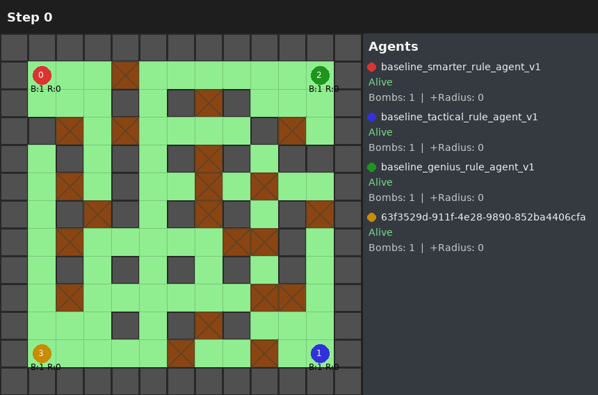

# Bomberland: GDGoC AI Challenge 2026
Welcome to the **GDGoC AI Challenge 2026**! This repository contains the complete infrastructure for running the Bomberland AI competition, including the registration server, the evaluation engine, and the leaderboard integration, as well as starter kits for working with the game engine + the engine source!

---

## About
Bomberland is a multi-agent AI competition inspired by the classic game [Bomb IT](https://gamevui.vn/bom-it-7/game).

Teams build intelligent agents using strategies from tree search to deep reinforcement learning. The goal is to compete in a 2D grid world collecting power-ups and placing explosives to take your opponent down.




---

## 💻 Requirements
*   **Python**: Version 3.11+
*   Packages: `numpy`, `pygame`, `torch`, `gymnasium`, and others (see `requirements.txt`)

---

## 🗺️ Project Navigation

### For Participants
*   **[Agent Guide](agent/README.md)**: How to develop, test, and submit your agent.
*   **[Competition Guide](docs/COMPETITION_GUIDE.md)**: Official guide and scoring mechanics.

### For Organizers
***Coming soon***
<!-- *   **[System Architecture](docs/ARCHITECTURE.md)**: Deep dive into the evaluation logic, database schema, and SOPs.
*   **[VM & Infrastructure Guide](docs/VM_USAGE.md)**: How to manage the GCP VM, systemd services, and monitoring.
*   **[Deployment Guide](docs/GCP_DEPLOYMENT.md)**: Step-by-step setup for a fresh GCP environment. -->

---

## 🏗️ Repository Structure

*   `competition/`: Core logic for the competition.
    *   `registration/`: Flask app for handling team registrations and submissions via webhooks.
    *   `evaluation/`: Background worker that runs matches and updates ratings (TrueSkill).
    *   `integrations/`: Connections to Google Drive, Google Sheets, and Discord.
*   `engine/`: The core Bomberland game engine.
*   `agent/`: Templates and examples for building your agent.
*   `scripts/`: Contains executable scripts.
    *   `participant/`: Scripts for testing and ranking agents locally.
    *   `organizer/`: Scripts for database management, background evaluation, and highlights.
*   `deploy/`: Systemd service files and VM setup scripts.

---

## 🚀 Quick Start (Local Testing & Organizer Scripts)

If you want to run the submission server locally for testing, follow these steps to accurately simulate the sandboxed VM environment:

1.  **Setup Environment**:
    ```bash
    conda activate aic_gdgoc
    pip install -r requirements.txt
    ```

2.  **Set Permissions**:
    <!-- Since evaluation engine drops privileges to the `nobody` user for security, allow `nobody` to read your submissions: -->
    ```bash
    chmod o+x /home/$USER          # Allows 'nobody' to traverse your home directory
    sudo chmod -R 755 submissions/ # Ensures sandbox can enter submission folders
    ```

3.  **Run Registration Server**:

    ```bash
    sudo /path/to/conda/env/bin/python3 -m competition.registration.app
    ```

4.  **Run Background Worker**:
    *(Runs a single batch of default 5 matches).*
    ```bash
    sudo /path/to/conda/env/bin/python3 -m scripts.organizer.run_evaluation background
    ```

### Organizer Utilities
*   **Calibrate Baselines** (Resets to 100.0 and forces 600 matches):
    ```bash
    sudo /path/to/conda/env/bin/python3 -m scripts.organizer.calibrate_baselines --matches 600 --workers 6
    ```
*   **Reset Leaderboard** (Delete participants' submissions, keep baselines):
    ```bash
    sudo /path/to/conda/env/bin/python3 -m scripts.organizer.reset_to_baselines --db_path competition.db --yes
    ```
*   **Backup Database**:
    ```bash
    sudo /path/to/conda/env/bin/python3 -m scripts.organizer.backup_db
    ```
*   **Post Daily Highlights** (Generates highlight gifs and posts to Discord):
    ```bash
    sudo /path/to/conda/env/bin/python3 -m scripts.organizer.post_daily_highlights
    ```
*   **Run Grand Finals** (Tournament between top 8 agents + top baseline):
    ```bash
    sudo /path/to/conda/env/bin/python3 -m scripts.organizer.run_final_evaluation --matches_per_combo 50 --workers 6
    ```

---

## 💬 Community & Support
Join our community on [Discord](https://discord.gg/GqQJzuunBY)

Please let us know of any bugs or suggestions by [raising an issue](https://github.com/VLTisME/Bomberland-GDGoC-AI-Challenge/issues).